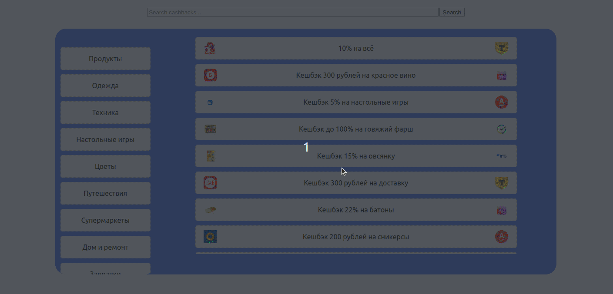

# AGGREGATE CASHBACK ACROSS BANKS

This app collects peronal cashback proposals across different banks.
It's possible due to [Open Banking API](https://openbankingrussia.ru/) that give access to banks' data for services like this one.

That's how it looks like:



## Running the Application

1. **Clone the Repository**
   ```bash
   git clone https://github.com/Avoca9o/hkt.git
   cd hkt
   ```

2. **Build and Run the Docker Containers**
   ```bash
   docker-compose up --build
   ```

   This command builds the images for the frontend and backend if they don't exist and starts the containers. The backend is available at `http://localhost:80/` and the frontend at `http://localhost:3000/`.

3. **Viewing the Application**

   Open a browser and navigate to `http://localhost:3000/` to view the React application.

## API Endpoints

The backend server has the following API endpoint:
- `POST /search`
   - Request body example:
   ```
         {
            'session_id': '42',
            'text': 'Косметика'
         }
   ```
   - Response body example:  
   ```
         [
            {
               'header': 'Кешбэк 5% на красную помаду',
               'description': 'Кешбэк 5% на красную помаду! Придайте своим губам яркий оттенок и получайте выгоду от каждой покупки!',
               'category': 'Косметика',
               'image': base64_letual_image,
               'bank_image': base64_sber_image,
               'bic': SBER_BIK
            },
            {
               'header': 'Кешбэк 9% на тушь для ресниц',
               'description': 'Кешбэк в размере 9% доступен на тушь для ресниц. Это отличная возможность не только обновить свою косметичку, но и сэкономить на покупках',
               'category': 'Косметика',
               'image': base64_podruzhka_image,
               'bank_image': base64_vtb_image,
               'bic': VTB_BIK
            }
         ]
   ```


## Stopping the Application

To stop the application and remove containers, networks, and volumes created by `docker-compose up`, you can use:
```bash
docker-compose down -v
```

